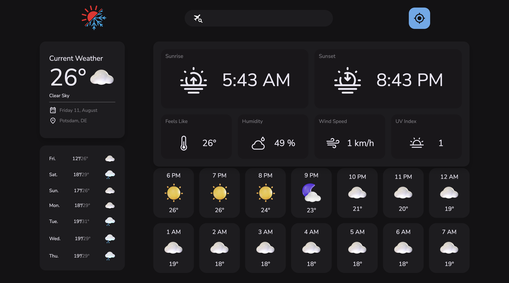

# Weather App 🌤️

A simple and user-friendly Weather App that provides current weather information for any location. Built using **HTML**, **CSS**, and **JavaScript**, it fetches real-time data from a weather API and displays it in an elegant UI.
---
## Features 🚀
- Displays current temperature, weather condition, and location details.
- Shows additional information like humidity, wind speed, and pressure.
- Responsive design for seamless viewing on all devices.
- Search functionality to get weather data for any city.
- Real-time weather updates using a weather API.
---
## Tech Stack 🛠️
- **HTML**: Markup structure of the app.
- **CSS**: Styling the user interface.
- **JavaScript**: Fetching and displaying weather data dynamically.
- **Weather API**: Fetches real-time weather data.
---
## Screenshots 📸
### Home Page

---
## Installation 🔧
Follow these steps to set up the project locally:
1. Clone the repository:
   ```bash
   git clone https://github.com/your-username/weather-app.git
## To check the code Please click on main then go to new branches for the project
